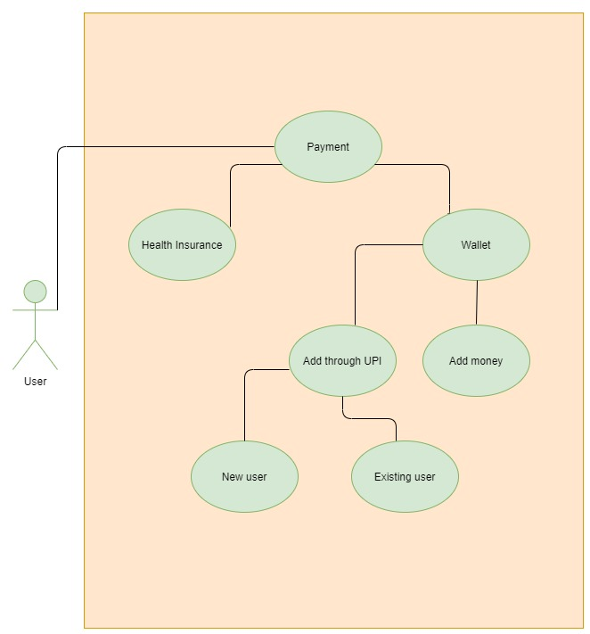
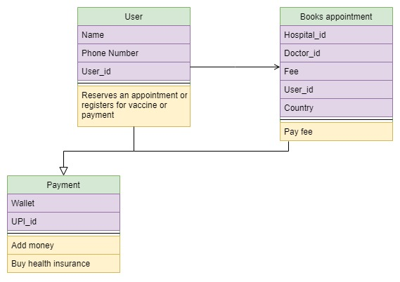
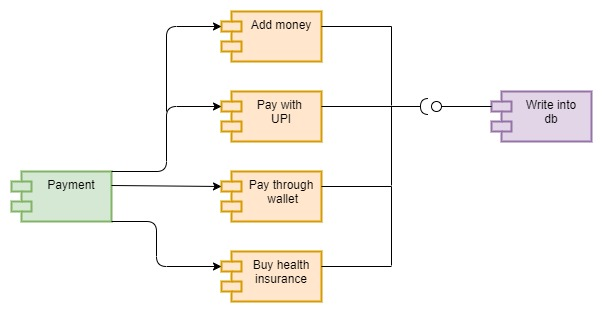
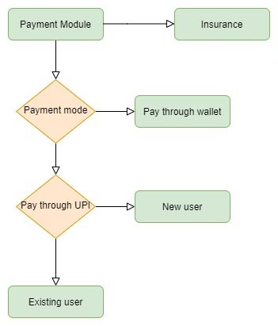

# Hospital Detail Management

## Activity Diagram(Hospital)

  

## Class Diagram(Hospital)

  

## Sequence Diagram(Hospital)

  

## Usecase Diagram(Hospital)

  

# Doctor Portal low-Level Uml Diagrams

## Class Diagram

  

## Doctor Portal Flow Chart

  

## Doctor Details 

  

## Sort patients

  

# Payment module

## Usecase 

  

## Class 

  

## Component

  

## Flow

  

## Vaccine module

## Usecase

  

## Activity

  

## Sequence

  

## Class

  

# Appointment Module

## Activity Diagram

  

## Component Diagram

  

## Sequence Diagram

  

## Usecase Diagram

  

